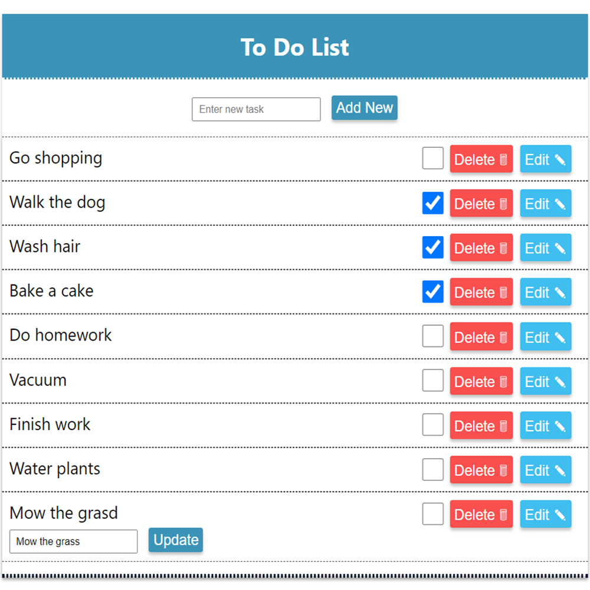

# Task List App

A task management app built with React and Redux, allowing users to add, edit, complete and delete tasks with smooth state handling and a clean, responsive interface.

## Demo

 

## Features

- Add new tasks easily  
- Edit existing tasks directly in the list  
- Delete tasks with a single click  
- State management handled by Redux  
- Responsive design 

## Technologies Used

- React  
- Redux  
- JavaScript  
- HTML  
- CSS  

## Installation / Usage

To run the app locally, follow these steps:

```bash
# Clone the repository
git clone https://github.com/yourusername/task-list-app.git

# Navigate to the project folder
cd task-list-app

# Install dependencies
npm install

# Start the development server
npm start
```

## Authors

 [Charlotte.D](https://github.com/C-Duberry)
